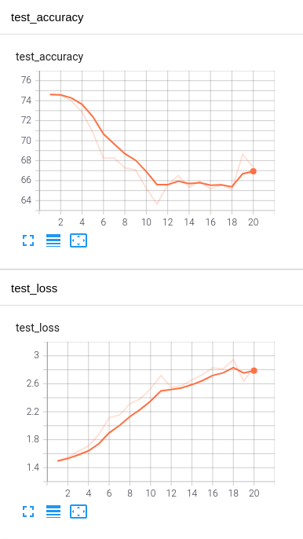
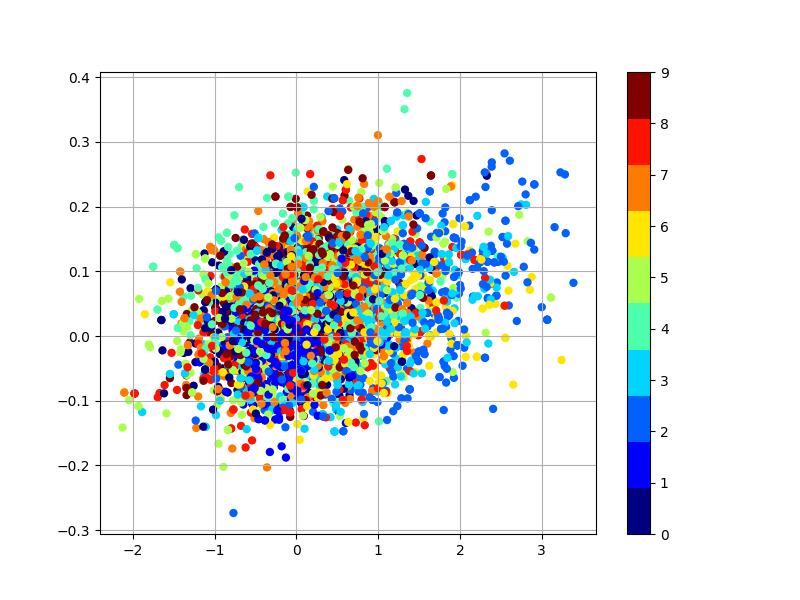
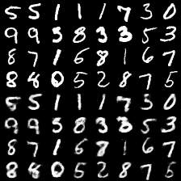
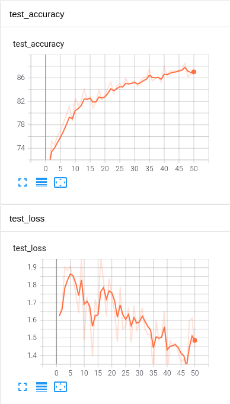
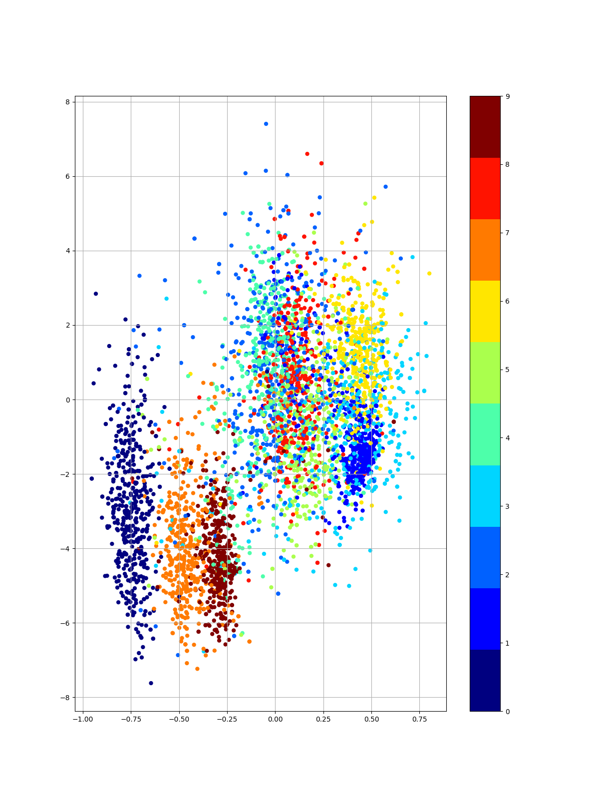
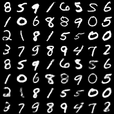

# bayesian_dnns
Practice &amp; experiment of bayesian deep neural networks, mainly using pixyz
## GMVAE  
Gaussian Mixed Variational Auto Encoder  
Proposed by [Rui Sue](http://ruishu.io/2016/12/25/gmvae/)
By using gaussian-mixtured prior for the generative model, its robustness for imbalanced data is much higher than Kingma's m2 model.
### Example: Imbalanced MNIST
- Data  
**labelled[label:number of train images]** 0:1000, 1:10, 2:10, 3:10, 4:10, 5:100, 6:70, 7:40, 8:50, 9:30
**unlabelled Total 50000 img. Ratio of each labels are same as labelled data.
**validation** Total 10000 img. Ratio of each labels are equal (balanced)

#### Result
#### Kingma's M2 model
  
Latent variables(dimension 0 and 1) and reconstructed images.    

  

#### GMVAE
  
Latent variables(dimension 0 and 1) and reconstructed images. You can see that each label seems to have its own distribution.  

 
